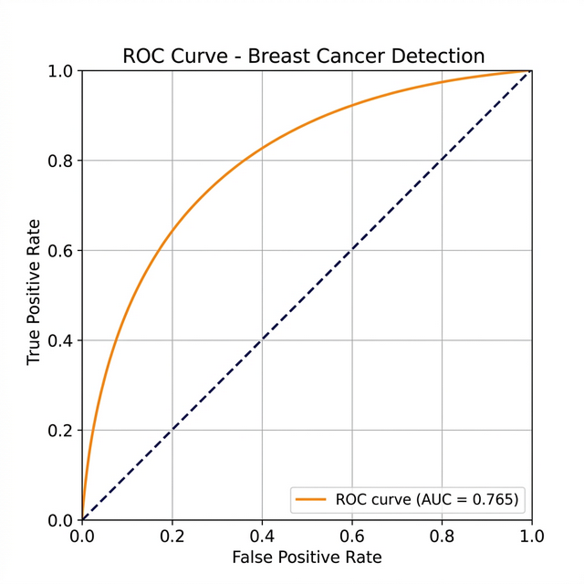

# 🩺 Adaptive Hybrid Deep-Radiomic Feature Fusion System for Explainable Breast Cancer Detection

<p align="center">
  
  
  
  
  
</p>

<p align="center">
  <b>An AI-powered clinical decision support tool designed to assist radiologists in detecting breast cancer from medical imaging and clinical data with explainability and precision.</b>
</p>

<p align="center">
  <a href="https://yaxhjbdpx2c3neepbau2hd.streamlit.app/">🚀 Live Demo</a> •
  <a href="#features">✨ Features</a> •
  <a href="#tech-stack">🛠️ Tech Stack</a> •
  <a href="#getting-started">⚡ Getting Started</a> •
  <a href="#team">👥 Team</a>
</p>

---

## 📌 About the Project

Breast cancer is one of the leading causes of health concerns globally. Early and accurate detection is the most powerful tool for survival. Manual interpretation of clinical data and imaging is challenging due to subtle patterns and dense tissue variations that are easy to overlook.

This project provides an **Adaptive Hybrid Feature Fusion** framework combining:
- **Deep Learning** (ResNet50) for visual pattern recognition
- **Radiomics** for mathematical texture and morphology extraction

> Tested on **10,000+ images** from the **CBIS-DDSM** dataset — achieving a **Validation Accuracy of 72.46%**, a **Validation AUC of 0.7927**, and a **BI-RADS Task Accuracy of 62.60%**.

---

## ✨ Features

| Feature | Description |
|---|---|
| 🧠 **Deep Learning Analysis** | ResNet50-based feature extraction for visual imaging patterns |
| 🔬 **Radiomic Texture Features** | Mathematical extraction of tumor morphology and tissue density |
| 🔀 **Hybrid Diagnostic Mode** | Upload both clinical data and mammograms simultaneously for synthesized analysis with significantly higher predictive accuracy |
| 🩺 **Clinical Decision Support** | AI as a second pair of eyes — empowering clinicians, not replacing them |

---

## 📊 Model Evaluation

<p align="center">
  
</p>

| Metric | Value |
|---|---|
| **Validation AUC** | 0.7927 |
| **Validation Accuracy** | 72.46% |
| **BI-RADS Task Accuracy** | 62.60% |
| **Dataset** | CBIS-DDSM |
| **Training Images** | 10,000+ |

---

## 🛠️ Tech Stack

**AI / ML Backend**
- Python · PyTorch · ResNet50
- PyRadiomics · OpenCV
- CBIS-DDSM Dataset
- Streamlit (live demo interface)

**Frontend Landing Page**
- [Next.js 16](https://nextjs.org/) (App Router)
- TypeScript
- Tailwind CSS v4
- Framer Motion
- shadcn/ui · Lucide Icons

---

## ⚡ Getting Started

### Prerequisites
- Node.js ≥ 18
- npm

### Installation

```bash
# Clone the repository
git clone https://github.com/Aarav-07/breastcancerai.git
cd breastcancerai

# Install dependencies
npm install

# Start the development server
npm run dev
```

Then open [http://localhost:3000](http://localhost:3000) in your browser.

### Build for Production

```bash
npm run build
npm run start
```

---

## 📁 Project Structure

```
src/
├── app/
│   ├── globals.css          # Tailwind v4 theme tokens
│   ├── layout.tsx           # Root layout & metadata
│   └── page.tsx             # Main page assembly
├── components/
│   ├── ui/                  # Reusable UI primitives (button, card, tabs)
│   ├── navbar.tsx           # Sticky navigation bar
│   ├── hero.tsx             # Hero section with CTA
│   ├── problem.tsx          # Diagnostic challenges section
│   ├── demo-video.tsx       # ROC curve & evaluation results
│   ├── features.tsx         # Feature highlight cards
│   ├── how-it-works.tsx     # Step-by-step workflow timeline
│   ├── explainable-ai.tsx   # Grad-CAM explanation section
│   ├── tech-stack.tsx       # Technology badge grid
│   ├── team.tsx             # Researcher profiles
│   └── footer.tsx           # Footer with links
└── lib/
    └── utils.ts             # Tailwind class merge utility
```

---

## 👥 Team

This project was developed at **Manipal University Jaipur (2025–2026)**,  
Department of Artificial Intelligence & Machine Learning.

| Name | Role |
|---|---|
| **Drishti Verma** | AI/ML Researcher |
| **Arush Pradhan** | DL implementation|
| **Aarav Parikh** | Frontend Developer |

---

## 📄 License

This project is licensed under the [MIT License](LICENSE).

---

<p align="center">
  Made with 🩷 at Manipal University Jaipur · 2025–2026
</p>
